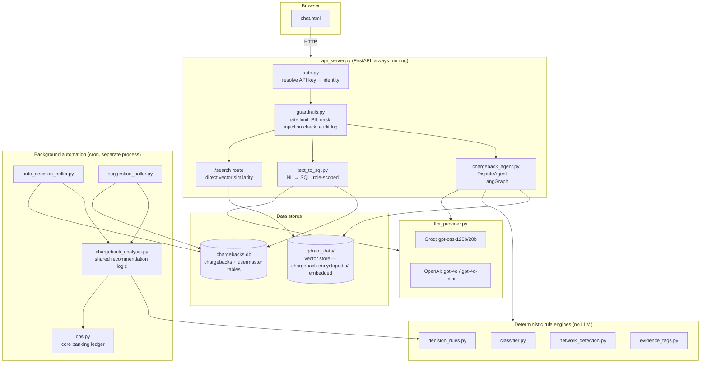

# Chargeback Assistant

A RAG-powered chargeback dispute assistant for Airtel Payments Bank merchants and bank admin staff. It combines a searchable knowledge base of chargeback rules with an AI agent that helps a merchant decide whether to fight or accept a chargeback and drafts the rebuttal letter for them, a plain-English query layer over each merchant's chargeback records, and a background automation layer that can act on straightforward cases without a human clicking anything.

This document is written for a reader with no prior context on the project — it explains the business problem first, then the architecture, then walks through every file and class in the codebase.

---

## Table of contents

1. [What problem does this solve?](#what-problem-does-this-solve)
2. [What can you do with it?](#what-can-you-do-with-it)
3. [Architecture at a glance](#architecture-at-a-glance)
4. [How a request actually flows through the system](#how-a-request-actually-flows-through-the-system)
5. [Design principles](#design-principles)
6. [Module reference](#module-reference)
7. [Class reference](#class-reference)
8. [Setup](#setup)
9. [Running](#running)
10. [Demo logins](#demo-logins)
11. [Testing](#testing)
12. [File map (quick reference)](#file-map-quick-reference)

---

## What problem does this solve?

When a customer pays a merchant through a card network (Visa, Mastercard, Amex) or UPI (India's real-time payment rail, via the NPCI network), and the customer later disputes that payment with their bank, the bank claws the money back from the merchant immediately. This is called a **chargeback**. The merchant then has a limited window to either:

- **Fight it** — submit evidence (delivery proof, signed receipts, authentication logs, etc.) arguing the chargeback is invalid, or
- **Accept it** — let the refund stand, because fighting isn't worth it or the customer is right.

Every chargeback carries a **reason code** (e.g. Visa `13.1` = "merchandise/services not received", Mastercard `4853` = "cardholder dispute", RuPay/NPCI `U001`–`U0xx` for UPI-specific reasons) that determines exactly what evidence would actually help. Getting this wrong — fighting with the wrong evidence, or not fighting when you had a strong case — costs merchants money either way. Most merchants aren't chargeback specialists and don't know, off the top of their head, what a given reason code requires or how much time they have left to respond.

This project exists to close that knowledge gap: it puts a searchable version of chargeback policy in front of merchants and bank staff, and an agent that can walk a specific case through the fight-or-refund decision automatically.

## What can you do with it?

The app has three tabs in the chat UI, plus one background feature that runs without any UI at all:

1. **Q&A Search** — ask general questions about chargeback policy: "What's the difference between Visa 10.4 and 13.1?", "What evidence do I need for a Mastercard fraud dispute?", "What happens if I get a chargeback for a Google Pay transaction?" Answered from a 149-document knowledge base (`chargeback-encyclopedia/`) using semantic search — no LLM reasoning involved in retrieval, and for most query types, no LLM call at all.

2. **Dispute Assistant** — describe an actual chargeback you received ("Mastercard chargeback, customer says the charge is fraudulent, but they placed the order through our 3D Secure checkout") and the agent will ask a follow-up if it's missing information, extract what evidence you have, recommend fight or refund, and — if fighting — draft an actual rebuttal letter addressed to your acquiring bank. Login here is optional but adds real value: once you select your merchant identity (same selector as the "My Chargebacks" tab), the welcome screen shows a live summary of your open chargebacks and one clickable suggestion per case — picking one grounds the whole conversation in that case's real database row (actual reason code, actual amount) instead of whatever the agent can infer from free text, and skips straight to a recommendation when one is already available rather than asking you to re-describe a case the system already has on file.

3. **My Chargebacks** — ask questions about your own chargeback record history in plain English: "how many open chargebacks do I have?", "show me everything due this week." Converted to SQL behind the scenes, scoped so you can only ever see your own data (unless you're logged in as bank staff, who can see across all merchants).

4. **Auto-decision automation** (no UI — runs as a scheduled job) — a merchant can opt in to having the same fight/refund logic the Dispute Assistant uses applied automatically to their open chargebacks on a schedule, instead of requiring them to describe each case manually. Merchants who don't opt in still get an advisory suggestion written onto their case, without anything being auto-applied.

## Architecture at a glance



There are really two separate "backends" here:

- **A live, always-on FastAPI server** (`api_server.py`) that the chat UI talks to over HTTP. This handles everything a person is actively waiting on: search, dispute conversations, database questions.
- **A background automation layer** (`chargeback_analysis.py`, `auto_decision_poller.py`, `suggestion_poller.py`, `cbs.py`) that runs periodically (e.g. via cron), completely independent of the web server, and acts on or advises about chargebacks nobody is actively chatting about right now.

Both layers ultimately reach into the same `chargebacks.db` SQLite database and reuse the same `decision_rules.py` fight/refund logic, so a merchant gets the same answer whether they ask the Dispute Assistant directly or let the automation decide for them.

## How a request actually flows through the system

### 1. Asking a knowledge-base question (Q&A tab)

```
Browser → GET /search?query=... → api_server.py
        → embed the query text (FastEmbed)
        → vector_store.py: search_chunks() against Qdrant
        → network_detection.py: does this query name a specific
          card network / UPI app? boost matching results
        → return ranked chunks with source document + score
```

No LLM call happens here at all for most queries — this route is deliberately "dumb" similarity search plus a scoring boost, so a merchant gets an instant, cheap answer. `chargeback_agent.py`'s `_answer_question_node` handles the same underlying question types when reached through the Dispute Assistant instead (it does one LLM call, to actually *write* a prose answer from the retrieved chunks, rather than just listing them).

### 2. Describing a chargeback (Dispute Assistant tab)

```
Browser → POST /dispute {query, additional_context}
          + optional X-Merchant-Key header → api_server.py
        → guardrails.py: rate limit check, length check,
          prompt-injection check, PII masking
        → if X-Merchant-Key present: auth.resolve_identity() — resolved
          on a best-effort basis (never required; a missing/invalid key
          just means an anonymous session, same as before this existed)
        → chargeback_agent.py: DisputeAgent.run(..., merchant_id=...)
            → validate_node       — is this really a dispute? filter
                                     junk/non-informative follow-up replies
            → planner_node        — regex-extract network + reason code,
                                     retrieve relevant policy chunks; if the
                                     query names a real UTR/case ID AND a
                                     merchant identity is known, fetch that
                                     exact row from chargebacks.db and
                                     ground the answer in chargeback_analysis
                                     .py's real recommendation for it instead
                                     of guessing from free text
            → detect_settlement_node — is this actually a missing-payment
                                     issue rather than a real chargeback?
            → extract_code_node   — do we know the reason code yet?
                                     if not: ask_user (END, wait for reply)
            → detect_clarification_node — is the merchant asking us a
                                     question instead of answering?
            → extract_evidence_node — what evidence does the merchant have,
                                     mapped to the fixed EvidenceTag vocabulary;
                                     skipped entirely for reason codes where
                                     decision_rules.py already knows no
                                     evidence changes the outcome
            → decide_node          — decision_rules.py lookup table first,
                                     LLM judgment call only if the code
                                     isn't in the table
            → generate_node        — draft the rebuttal letter (or refund
                                     guidance), grounded only in confirmed
                                     evidence and a confirmed reason code
            → reflect_node         — deterministic groundedness check: does
                                     every code/claim in the draft actually
                                     trace back to real state? no LLM call
        → return decision, confidence, evidence checklist, letter text
```

The graph can pause and resume — if it doesn't yet have enough information (no reason code, or no evidence details), it ends early with a question for the merchant, and the next `/dispute` call carries their reply forward as `additional_context`.

A related endpoint, `GET /my-open-chargebacks`, powers the case-picker described above — merchant-only, backed by a plain SQL query (`merchant_db.list_open_chargebacks()`), no LLM involved.

### 3. Asking about your own chargeback data (My Chargebacks tab)

```
Browser → POST /query {question} + X-Merchant-Key header → api_server.py
        → auth.py: resolve the key to an Identity (user_id, role, merchant_id)
                    — never trust identity claimed in the request body
        → text_to_sql.py: query_chargebacks(question, role, merchant_id)
            → LLM translates the question into SQL
            → _is_safe_sql(): SELECT-only, no writes/UNION/stacked queries
            → if role == "merchant": force-inject
              WHERE merchant_id = <caller's own id>, no matter what the
              LLM wrote or what the question asked about
            → if role is an admin role: run as generated, across all
              merchants (or one, if the question names it)
        → execute against chargebacks.db, format, return
```

### 4. Background automation (no browser involved)

```
cron → auto_decision_poller.py (merchants who opted in)
     → for each Open chargeback:
         chargeback_analysis.py.analyze()
           → cbs.py: was this transaction already refunded outside
             the dispute process? if so, that settles it regardless
             of reason code
           → else: decision_rules.py lookup for this network+code
         → if a confident recommendation exists: write it back to
           chargebacks.db as the case's resolution

cron → suggestion_poller.py (merchants who did NOT opt in)
     → same analysis, but only writes a suggested_action /
       suggestion_reason — never changes status. The merchant sees
       the advice next time they check, and decides for themselves.
```

## Design principles

A few decisions repeat throughout the codebase and are worth knowing before reading further:

- **Rule-based over LLM-based, deliberately.** Anywhere a task is really pattern matching rather than free-text reasoning — classifying what kind of message a user sent, extracting a network/reason code from text, deciding fight-vs-refund for a known code — the code uses plain Python regex/lookup tables (`classifier.py`, `decision_rules.py`, `network_detection.py`) instead of an LLM call. This is faster, free, deterministic, and testable with ordinary unit tests. LLM calls are reserved for genuinely open-ended tasks (writing prose, judging ambiguous free text) and are always given a rule-based fallback or backstop where practical.

- **Defense-in-depth for anything security-relevant.** Row-level data scoping (a merchant can only see their own chargebacks), SQL safety, and PII handling are never enforced only by "the LLM was told to behave" — there is always a second, code-level check that doesn't depend on the LLM obeying instructions. See `text_to_sql.py`'s forced `WHERE merchant_id = ...` injection and `guardrails.py`'s `_is_safe_sql()`.

- **Single-responsibility nodes with routing kept separate from logic.** `chargeback_agent.py`'s LangGraph nodes each do exactly one thing (classify, extract, decide, write); which node runs next is decided only by dedicated `_route_after_*` functions, never by a node branching internally. This makes each step independently testable and the overall flow easy to trace.

- **Shared modules to prevent silent drift.** Wherever two different call sites need to agree on the same logic (which LLM/model to use, how to detect a payment network from free text, how to split documents into chunks), that logic is factored into its own small module (`llm_provider.py`, `network_detection.py`, `chunking.py`) rather than duplicated — so a future change to one can't accidentally leave the other behind.

## Module reference

### Web server

- **`api_server.py`** — the always-running FastAPI process everything else sits behind. Serves the chat UI (`chat.html`) at `/`, exposes `/search`, `/dispute`, `/my-open-chargebacks`, `/query`, `/auto-decision`, `/documents`, `/health`, and `/merchants`. Owns the single shared `VectorStore` and embedding model instance used by every request (Qdrant's local file mode only allows one process to hold the storage lock at a time, which is why only one `api_server.py` instance can run). Wires every request through `auth.py` and `guardrails.py` before it reaches any business logic. `/dispute` is the one exception to "always requires identity" elsewhere in the app — its `X-Merchant-Key` header is optional, since the Q&A tab shares this same endpoint and must stay usable with no login at all.

### The dispute agent

- **`chargeback_agent.py`** — the largest file in the project. Defines the `DisputeAgent` class, a LangGraph state machine that runs the multi-turn dispute conversation described above. Each LLM-calling step gets its own narrow "persona" system prompt (e.g. "chargeback evidence analyst") rather than one general-purpose assistant character across the whole conversation, which keeps each step's output focused and easier to constrain. Also home to `_filter_substantive_context()`, the LLM backstop that catches follow-up replies which don't actually answer the question asked (see `classifier.is_junk_reply` below for the first, cheaper layer of that same check). Its knowledge-base-question handler (`_answer_question_node`) also recognizes when a question is actually asking for the caller's *own* chargeback data ("list my open chargebacks") rather than general policy, and routes that to a real database query instead of letting the model guess — earlier behavior here could fabricate a plausible-looking but entirely fictional list of chargebacks when asked this kind of question with no real data to draw on.

### Deterministic rule engines (no LLM calls)

- **`classifier.py`** — turns free text into structured signals without ever calling an LLM: `classify_query_type()` (is this a dispute, a general question, an escalation request, or invalid input?), `extract_network_and_code()` (pull out things like "Visa 13.1" or "4853" via regex), `detect_settlement_issue()` (is this actually about a missing payment rather than a real chargeback?), `is_junk_reply()` (does a follow-up reply carry any real information, or is it filler/gibberish/an echoed repeat of the original question?), and `is_confidently_substantive()` (can we trust a reply is real without needing to ask an LLM to confirm?). Handles both English and Hinglish phrasing throughout.

- **`decision_rules.py`** — a hand-curated lookup table mapping `(card network, reason code)` to the evidence required to fight it, and the resulting `fight` or `refund` decision. Reason codes not in the table fall through to an LLM judgment call in `chargeback_agent.py` instead of failing — this table is additive, not a hard gate. Curated by hand rather than derived automatically from the encyclopedia's frontmatter, because the 149 encyclopedia documents use two different, incompatible metadata layouts. A rule can also be marked `always_refund` for codes where liability sits entirely with a third party by definition (e.g. RuPay U010, a technical/system-failure code) — no evidence the merchant could supply changes the outcome, so these skip evidence-gathering and the LLM judgment call entirely rather than relying on a model to consistently reach the same conclusion turn after turn.

- **`evidence_tags.py`** — defines the fixed, closed vocabulary of evidence types (`EvidenceTag`) that both `chargeback_agent.py` and `decision_rules.py` depend on. Kept in its own tiny module specifically to avoid those two files needing to import each other in a circle.

- **`network_detection.py`** — shared logic for recognizing which payment network a query is actually about, including recognizing consumer app names (Google Pay, PhonePe) as referring to UPI/NPCI even when no technical term like "UPI" appears. Used by both the Dispute Assistant and the plain `/search` endpoint so they can't disagree about what counts as a network reference.

### Knowledge base and retrieval

- **`vector_store.py`** — a thin wrapper around Qdrant (a vector database) running in local file mode, meaning no separate server process or Docker container is needed; everything is stored under `qdrant_data/`. Defines the `VectorStore` class, which manages two parallel collections: one holding whole documents, one holding heading-based chunks of the same documents for more precise retrieval. Also blends in classic keyword search (BM25) alongside vector similarity.

- **`chunking.py`** — splits each encyclopedia document into smaller, heading-based pieces (rather than fixed-size or LLM-based chunking) before it's embedded, since most of the source documents already have meaningful `##`/`###` structure to split on. Also builds a short, deterministic "contextual prefix" for each chunk (document title, network, section) so an isolated chunk still carries enough context to be useful on its own.

- **`load_encyclopedia.py`** / **`load_chargeback_docs.py`** — one-time (or after-you-edit-the-docs) indexing scripts. They read `chargeback-encyclopedia/`, split each file with `chunking.py`, embed the results, and load them into Qdrant. `load_chargeback_docs.py` handles a smaller set of specially curated docs; `load_encyclopedia.py` handles the rest of the corpus.

- **`rag_server.py`** / **`rag_client.py`** — an earlier, separate prototype built on the MCP (Model Context Protocol) standard rather than plain HTTP. `rag_server.py` exposes `add_document`/`search`/`list_documents` as MCP tools; `rag_client.py` demonstrates Claude calling them directly. Kept in the repo but not wired into `api_server.py` — changes to one do not affect the other.

### Natural-language database queries

- **`text_to_sql.py`** — turns a plain-English question about a merchant's chargebacks into SQL, runs it, and formats the result. Enforces role-based scoping at the code level (not just via the LLM's prompt): a `merchant` role always gets `WHERE merchant_id = <their own id>` force-injected regardless of what SQL the LLM generated or what the question asked about; admin roles are not scoped. Also enforces that only `SELECT` statements can ever run. A separate, earlier check recognizes an escalation attempt ("show me other merchants'/users'/customers' data") in plain language before SQL generation even runs, so a merchant gets a clear "you can only query your own data" message rather than the SQL-generation step failing on an ambiguous request and surfacing a confusing, unrelated-looking error — the row-level scoping itself is unconditional either way.

- **`merchant_db.py`** — defines and seeds the `chargebacks` table in `chargebacks.db`: the actual NPCI/UPI dispute records merchants and admins query against. Also provides `list_open_chargebacks(merchant_id)`, a small direct SQL helper (no LLM) that powers the Dispute Assistant's case-picker.

- **`usermaster.py`** — defines and seeds the `usermaster` table: who can log in, what role they have, and (for merchants) which merchant they're scoped to. Also stores each merchant's `auto_decision` preference (`manual` or `auto`), which the background pollers read.

- **`auth.py`** — resolves the `X-Merchant-Key` header on every request to a full `Identity` by looking it up against `usermaster`, using a constant-time comparison (to avoid leaking key validity through response-timing side channels). The server never trusts an identity claimed in the request body itself.

### Background automation

- **`cbs.py`** — a dummy "Core Banking System" ledger: the one source of ground truth for whether a given transaction was already refunded *outside* the formal dispute process (e.g. a goodwill refund). A customer can mistakenly file a chargeback on something they were already refunded for — this table is what settles that, rather than trusting either side's unverified claim.

- **`chargeback_analysis.py`** — the single shared "what should happen to this chargeback" function, used by both pollers below so they can never quietly disagree. Checks `cbs.py` first (a confirmed duplicate refund always wins, regardless of reason code), then falls back to `decision_rules.py`'s evidence-based table.

- **`auto_decision_poller.py`** — a standalone script (run via cron, not part of the live server) that applies `chargeback_analysis.py`'s recommendation directly to every Open chargeback belonging to a merchant who has opted into `auto_decision = 'auto'`. Note this does not mean "always accept" or "always fight" as a blanket setting — it applies whatever the case-by-case analysis actually recommends; the opt-in only removes the manual confirmation step.

- **`suggestion_poller.py`** — the same analysis, for merchants who have *not* opted in. Never changes a case's status — it only writes an advisory `suggested_action`/`suggestion_reason` so the merchant sees a recommendation next time they look, without anything being decided for them. Only surfaces suggestions for cases with a response deadline coming up soon, so it doesn't nag about cases with months of runway left.

- **`create_test_chargeback.py`** — a developer utility to insert one fresh test chargeback (optionally with a matching CBS refund record) without having to wipe and re-seed the whole database, for testing the pollers above in isolation.

### Cross-cutting safety and provider config

- **`guardrails.py`** — six independent safety/operational utilities used across `api_server.py` and `chargeback_agent.py`: PII masking, prompt-injection detection, input length limits, a sliding-window rate limiter, an append-only (PII-safe) audit log, and a daily LLM-call cost circuit breaker.

- **`llm_provider.py`** — the single place that decides which AI provider and model to actually use, controlled by the `LLM_PROVIDER` environment variable (`groq`, the default, or `openai`). Both `chargeback_agent.py` and `text_to_sql.py` build their LLM clients through this module instead of constructing a provider client directly, so they can never end up pointed at different models by accident.

### Frontend

- **`chat.html`** — the entire frontend: a single self-contained HTML file (no build step, no separate framework) served directly by `api_server.py` at `/`. Implements the three-tab chat UI and talks to the backend purely over the HTTP endpoints listed above.

### Tests and evaluation

- **`test_classifier.py`** / **`test_decision_rules.py`** — plain `pytest` unit tests for the deterministic rule engines; no external services or API keys needed.
- **`test_search.py`** — an end-to-end retrieval smoke test against the real embedding model (needs the model downloaded, but no LLM API key).
- **`test_qa_stress.py`** / **`golden_queries.json`** / **`eval_retrieval.py`** — a larger adversarial/quality test set (100 stress-test queries across 10 categories, plus a 44-query "golden" retrieval benchmark) used to catch retrieval-quality regressions when the knowledge base or chunking strategy changes.

## Class reference

Most of this project's logic lives in module-level functions rather than classes (in line with the "simple pattern matching doesn't need an object" philosophy above), but a handful of real classes carry meaningful state or structure:

| Class | Where | What it represents |
|---|---|---|
| **`DisputeAgent`** | `chargeback_agent.py` | The compiled LangGraph state machine for the dispute conversation. Holds the primary/fallback LLM clients and exposes `.run(query, additional_context, merchant_id, thread_id)` as the one entry point `api_server.py` calls. |
| **`ChargebackState`** | `chargeback_agent.py` | A `TypedDict` describing everything the graph tracks across one conversation: the merchant's query, accumulated follow-up context, extracted network/reason code, evidence present/missing, the decision, the drafted letter, and groundedness/confidence results. Every node reads from and writes into this one shared shape. |
| **`VectorStore`** | `vector_store.py` | Wraps the Qdrant client and both collections (whole-document and chunk-level). Owns document/chunk indexing, similarity search, BM25 keyword search, and neighbor-chunk lookups. |
| **`RateLimiter`** | `guardrails.py` | Per-user sliding-window request limiter with abuse blocking, so one user hammering an endpoint can't degrade the app for everyone else. |
| **`AuditLogger`** | `guardrails.py` | Appends every interaction to a PII-masked, append-only JSONL file (`audit.log`) for compliance/traceability — never overwrites past entries. |
| **`CostCircuitBreaker`** | `guardrails.py` | Counts LLM calls per day and trips (returning HTTP 503) once a configured daily cap is hit, to keep a runaway loop or abuse pattern from generating unbounded API cost. |
| **`Identity`** | `auth.py` | A small dataclass — `user_id`, `role`, `merchant_id` — representing who is actually making a request, resolved server-side from their API key. Never constructed from anything the client claims about itself. |
| **`DecisionRule`** | `decision_rules.py` | One row of the fight/refund lookup table: which evidence tags are required or disqualifying for a specific `(network, reason_code)` pair, and the resulting decision. |
| **`Analysis`** | `chargeback_analysis.py` | The shared recommendation result (`action`, `reason`, `source`) both background pollers consume, so they can't drift on what a given case's recommendation actually is. |

`api_server.py` additionally defines a set of small Pydantic model classes (`DisputeRequest`, `DisputeResponse`, `SearchResult`, `QueryRequest`, `QueryResponse`, `AutoDecisionRequest`, `AutoDecisionResponse`, etc.) — these aren't business logic, just typed shapes for request/response bodies that FastAPI uses to validate input and generate the interactive `/docs` page automatically.

## Setup

```bash
python3 -m venv venv
source venv/bin/activate
pip install -r requirements.txt
```

Choose an LLM provider and set its API key. The default is Groq (free tier available):

```bash
export GROQ_API_KEY=your_key_here   # free at https://console.groq.com
```

Or, to use OpenAI instead:

```bash
export LLM_PROVIDER=openai
export OPENAI_API_KEY=your_key_here
```

Restart the server after changing `LLM_PROVIDER` — it's read once at startup. Without a valid key for whichever provider is configured, the server still starts, but the Dispute Assistant and natural-language query endpoints return 503.

## Running

```bash
python api_server.py
```

- Chat UI: [http://localhost:8000/](http://localhost:8000/)
- Interactive API docs: [http://localhost:8000/docs](http://localhost:8000/docs)

Only one server process can run at a time — the vector store (Qdrant, local file mode) holds an exclusive lock on `./qdrant_data`. If you see `Storage folder ./qdrant_data is already accessed by another instance`, stop the other running instance first.

If you've just cloned the repo (or edited `chargeback-encyclopedia/`), index the knowledge base before starting the server for the first time:

```bash
python load_encyclopedia.py
python load_chargeback_docs.py
```

## Demo logins

The chat UI's merchant/admin selector is populated from seeded demo accounts (see `usermaster.py`):

| Role | Scope |
|---|---|
| `merchant` (×4, one per demo Airtel merchant) | Own chargeback data only |
| `bankopsadmin`, `bankadmin_maker`, `bankadmin_checker` | All merchants' chargeback data |

Re-seed at any time with:

```bash
python merchant_db.py   # chargeback records
python usermaster.py    # login identities / roles
```

## Testing

```bash
pip install pytest
pytest test_classifier.py test_decision_rules.py -q   # fast, no external deps
pytest test_classifier.py::test_name -q                # a single test
python test_search.py                                   # retrieval smoke test (needs the embedding model, no API key)
```

## File map (quick reference)

| File | Role |
|---|---|
| `api_server.py` | Live FastAPI server — every HTTP endpoint |
| `chargeback_agent.py` | Dispute conversation agent (LangGraph) |
| `classifier.py` | Regex/keyword text classification |
| `decision_rules.py` | Fight/refund lookup table |
| `evidence_tags.py` | Closed evidence vocabulary |
| `network_detection.py` | "Which payment network is this about" detection |
| `vector_store.py` | Qdrant wrapper (whole-doc + chunk collections) |
| `chunking.py` | Document → chunk splitting rules |
| `load_encyclopedia.py`, `load_chargeback_docs.py` | Knowledge base indexing scripts |
| `rag_server.py`, `rag_client.py` | Separate MCP-based RAG prototype (not wired into `api_server.py`) |
| `text_to_sql.py` | Plain-English → SQL, role-scoped |
| `merchant_db.py` | `chargebacks` table + demo data |
| `usermaster.py` | `usermaster` table (logins/roles) + demo data |
| `auth.py` | API key → identity resolution |
| `guardrails.py` | Rate limiting, PII masking, audit log, cost cap |
| `llm_provider.py` | Groq/OpenAI provider selection |
| `cbs.py` | Dummy core-banking refund ledger |
| `chargeback_analysis.py` | Shared fight/refund recommendation logic |
| `auto_decision_poller.py` | Applies recommendations automatically (opted-in merchants) |
| `suggestion_poller.py` | Advisory-only recommendations (opted-out merchants) |
| `create_test_chargeback.py` | Dev utility: insert one test chargeback |
| `chat.html` | Frontend (single file, no build step) |
| `chargeback-encyclopedia/` | Knowledge base source content (149 markdown docs) |
| `test_*.py`, `golden_queries.json`, `eval_retrieval.py` | Tests and retrieval-quality evaluation |

See `CLAUDE.md` for a more terse, implementation-level version of this same architecture, aimed at AI coding assistants working in this repo.
